<h1 align="center">EasyAgent</h1>

<p align="center">
  <strong>IntelliJ IDEA AI 助手插件</strong><br>
  聚合 Claude Code / OpenCode / Codex CLI，统一管理会话、计划与执行
</p>

<p align="center">
  <a href="https://github.com/hyqf98/EasyAgent"></a>
  
  
  
</p>

---

EasyAgent 是一个 IntelliJ IDEA 插件，将多个 AI CLI 编码助手统一接入 IDE，提供会话管理、计划看板、任务编排与自动执行等能力，同时保持贴近 IDEA 原生的交互体验。

## 功能概览

### 统一入口：多 CLI 一键启动

从统一首页选择 **Claude Code**、**OpenCode** 或 **Codex** 即可开始对话，也支持进入 **计划模式** 让 AI 编排多步骤任务。

<p align="center">
  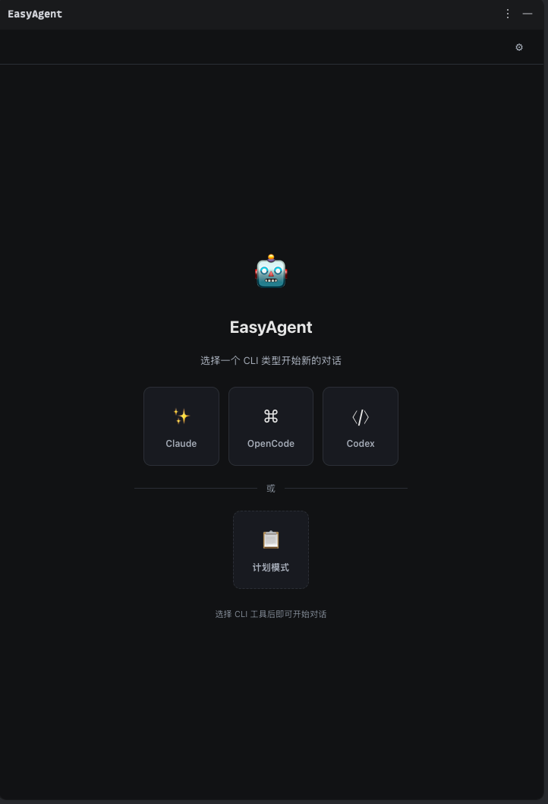
</p>

### 会话管理

左侧会话列表管理所有对话历史，支持**全选 / 批量删除**、快速切换会话，当前会话高亮标记。

<p align="center">
  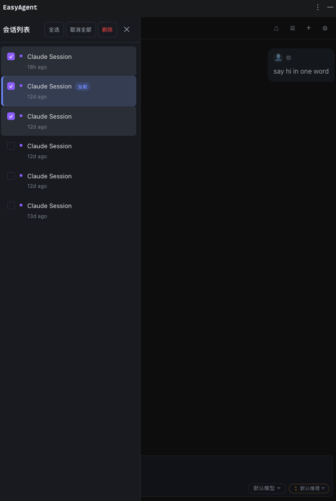
</p>

### 对话交互

聊天窗口内实时流式渲染 AI 回复，支持**思考过程可视化**、**命令执行面板**（Bash/Python 等）、**结构化输出表格**和 **Diff 对比**。AI 完成修改后可直接在 IDEA 中查看 diff 并一键回撤。

<p align="center">
  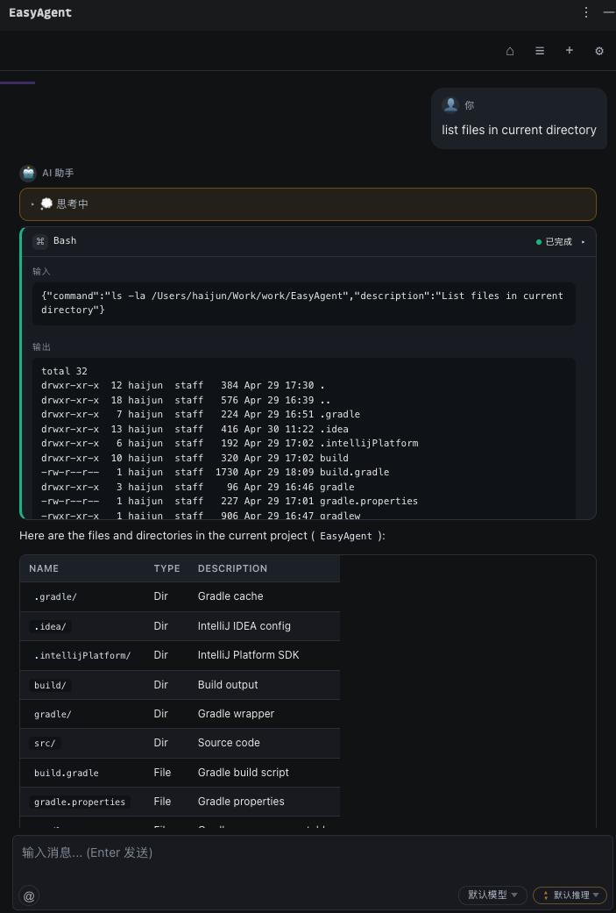
</p>

### 斜杠命令

输入 `/` 即可唤起命令面板，支持模糊搜索匹配，键盘上下切换、Enter 选中，轻松调用各类 Skills。

<p align="center">
  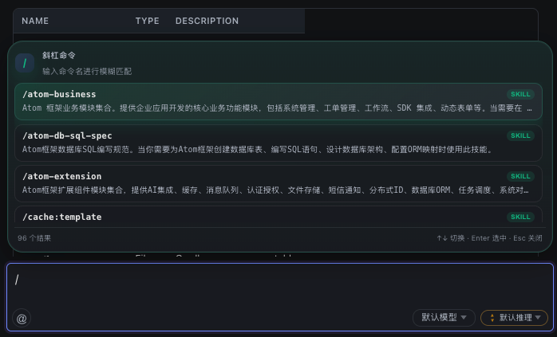
</p>

### 文件引用

输入 `@` 唤起文件选择器，键入文件名即可模糊搜索项目中的任意文件，Enter 一键引用到对话上下文。

<p align="center">
  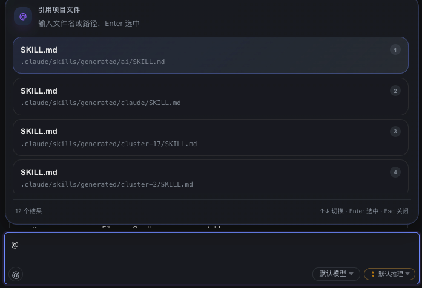
</p>

### 图片粘贴

聊天窗口支持直接**粘贴剪贴板中的图片**发送给 AI 进行分析，截图、设计稿、错误信息一目了然。

<p align="center">
  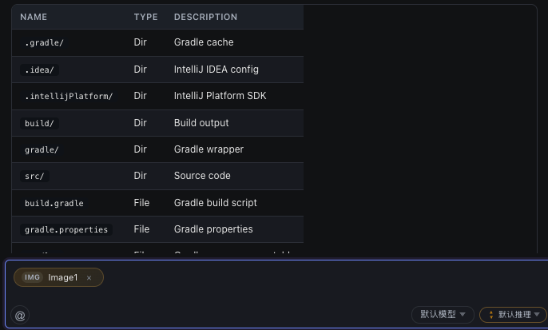
</p>

### 模型管理

内置模型管理页面，支持 **Claude / OpenCode / Codex** 三类模型提供商的独立配置。可查看模型 ID、显示名称、上下文窗口大小，支持**同步远程**模型列表和**自定义添加**模型。

<p align="center">
  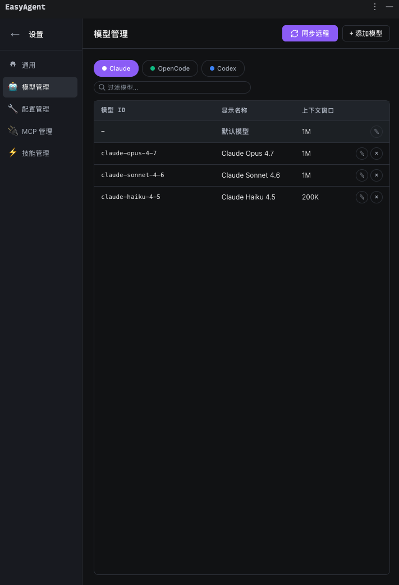
</p>

### 配置管理

集中管理各 CLI 提供商的**连接配置**：Base URL、API Key、Auth Token、Model 选择，支持多套配置文件间快速切换。

<p align="center">
  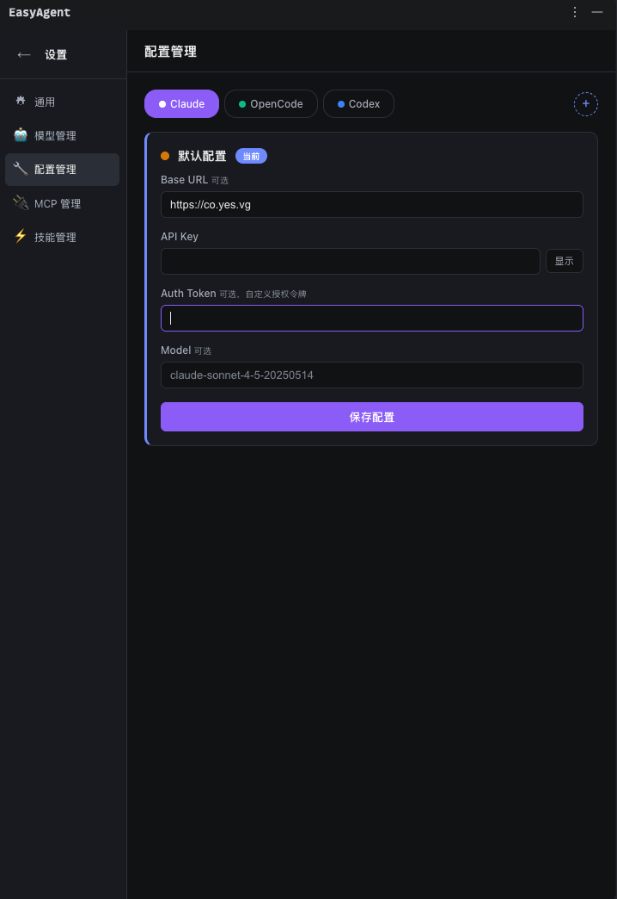
</p>

### MCP 管理

内置 MCP 服务器管理面板，支持添加、测试、编辑、删除 MCP 服务器，显示连接类型（Stdio / HTTP）和用户级别。开箱支持 **Playwright**、**GitNexus**、**ops-automation**、**Pencil** 等 9+ 个 MCP 服务器。

<p align="center">
  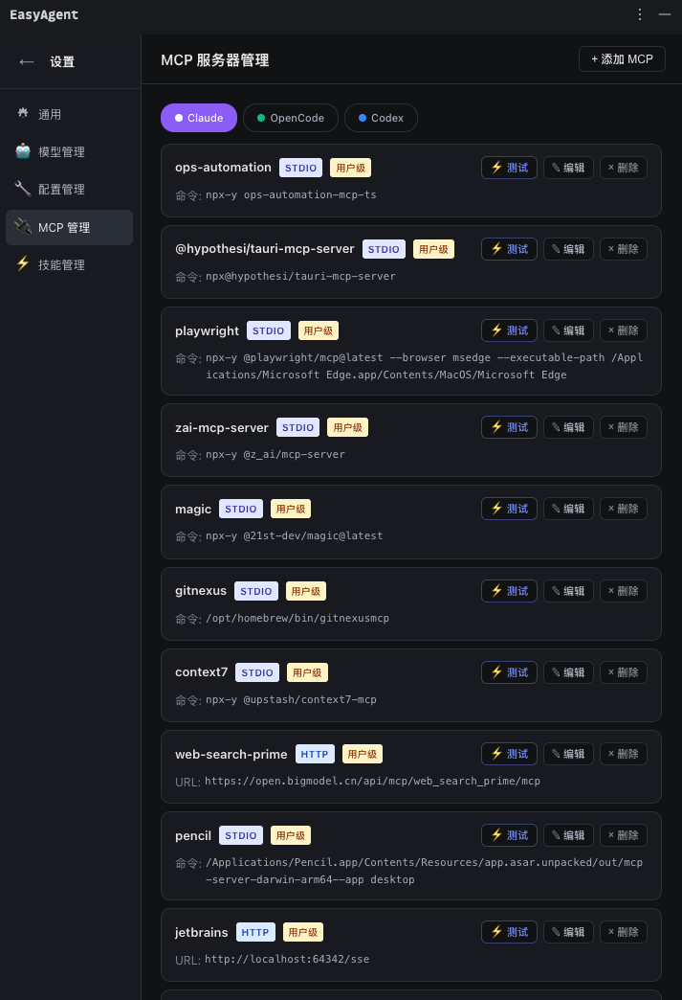
</p>

### Skills 管理

管理 AI Skills 列表，支持**批量启用/禁用**、搜索过滤。Slash 命令和 Skills 深度集成，输入 `/` 即可实时匹配可用技能。

<p align="center">
  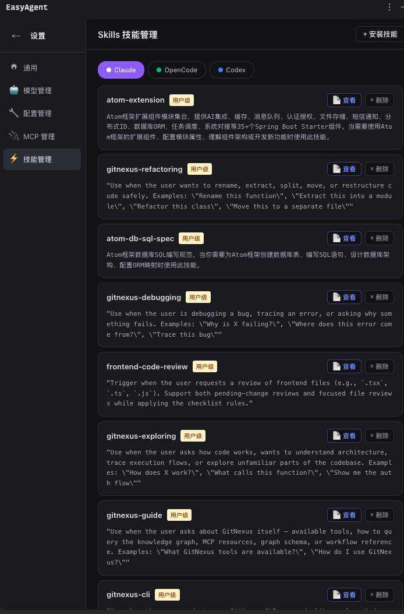
</p>

### 插件管理

支持管理多个 AI 工具插件，统一配置和切换。

<p align="center">
  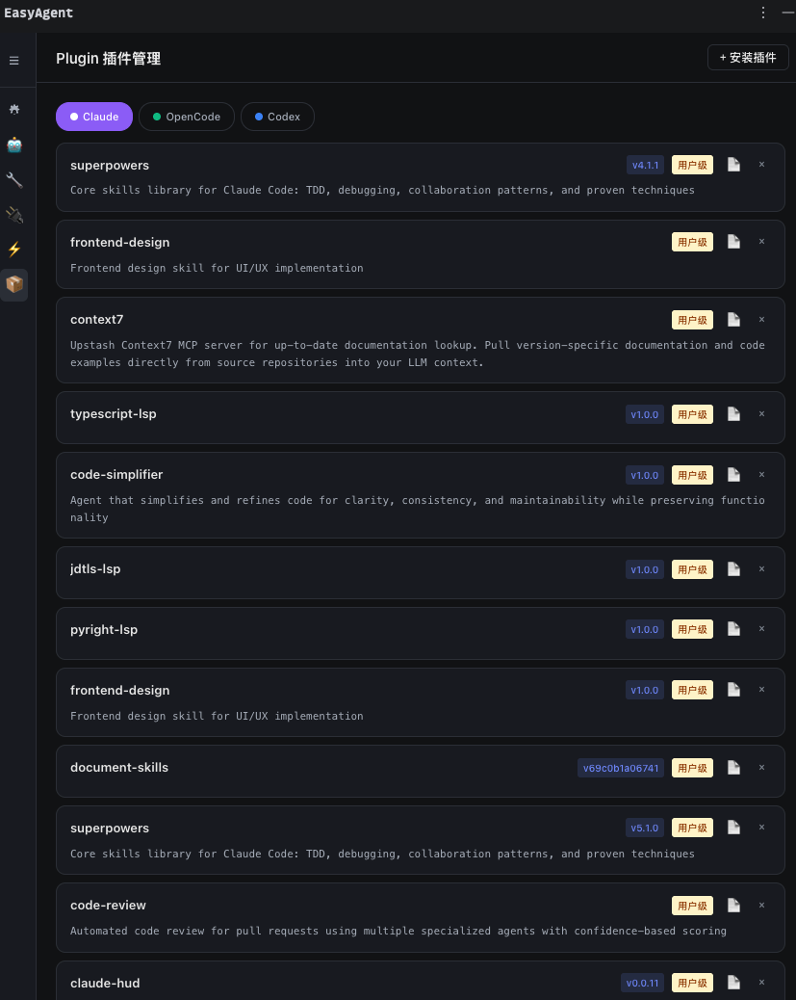
</p>

### 任务看板

**计划模式**下 AI 自动拆解任务，以看板形式呈现四阶段流程：

| 待办 | 进行中 | 已完成 | 失败 |
|------|--------|--------|------|
| 等待执行的任务 | 当前正在执行 | 执行成功的任务 | 执行失败的任务 |

支持**拖拽**跨列移动任务、列内自由排序、**并发执行**（可配置并发数）、执行记录搜索、失败任务重试。

<p align="center">
  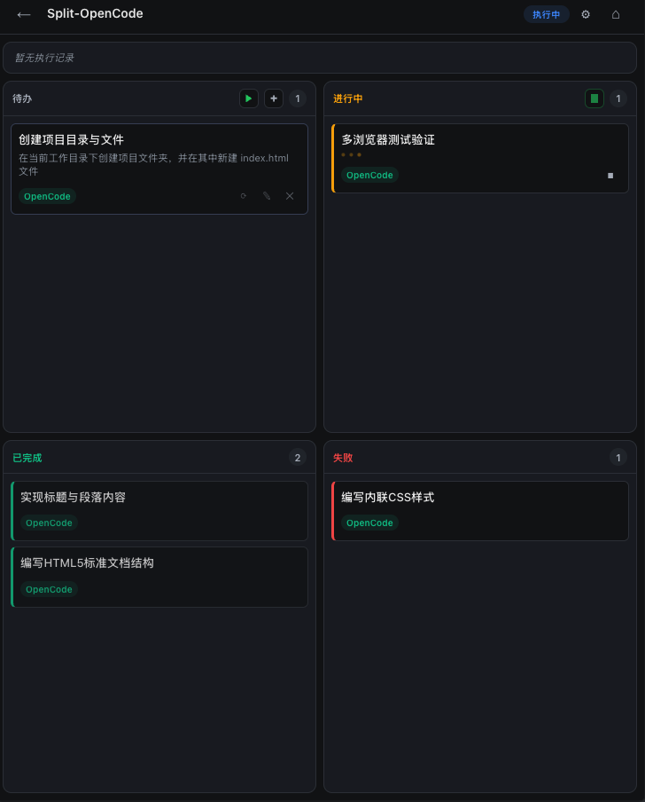
</p>

## 支持的 CLI 工具

| 工具 | 说明 | 安装方式 |
|------|------|----------|
| Claude Code | Anthropic 官方 CLI 编码助手 | `npm install -g @anthropic-ai/claude-code` |
| OpenCode | 开源终端 AI 编码工具 | `npm install -g opencode` |
| Codex | OpenAI 官方 CLI 编码助手 | `npm install -g @openai/codex` |

## 快速开始

### 环境要求

- JDK 17+
- IntelliJ IDEA 2026.1+（Build 261.*）
- 至少安装一个支持的 CLI 工具

### 构建与运行

```bash
# 运行插件（启动沙箱 IDEA）
./gradlew runIde

# 编译
./gradlew compileJava

# 打包
./gradlew buildPlugin

# 测试
./gradlew test
```

## 项目结构

```
src/main/java/io/github/easyagent/
├── ai/                         # AI 模块：CLI 适配与流式响应解析
│   ├── provider/               # 抽象基类（进程管理、重试机制）
│   ├── claude/                 # Claude Code 专属实现
│   ├── opencode/               # OpenCode 专属实现
│   ├── codex/                  # Codex 专属实现
│   └── entity/                 # 统一响应实体
├── plan/                       # 计划模块：计划与任务的 CRUD、执行概要生成
├── session/                    # 会话模块：各 CLI 本地会话读取与管理
├── enums/                      # 通用枚举（CLI 类型、消息类型、任务状态等）
├── settings/                   # 配置管理（AppState、CLI 配置、MCP、Skills）
├── ui/                         # UI 层：JCEF 浏览器组件、消息桥接、交互服务
│   ├── jcef/                   # JCEF WebView 与 JS Bridge
│   └── service/                # ChatManager、对话管理
└── util/                       # 工具类（JSON、枚举适配）

src/main/resources/web/         # 前端资源（Vue.js + 原生 JS）
├── js/plan/                    # 计划看板视图
├── js/settings/                # 设置页面
├── js/chat/                    # 聊天视图
├── css/                        # 样式文件
└── index.html                  # 入口页面
```

## 技术栈

| 层级 | 技术 |
|------|------|
| 插件框架 | IntelliJ Platform Plugin SDK |
| 构建 | Gradle + IntelliJ Platform Gradle Plugin 2.x |
| JDK | 17（虚拟线程、record、switch 箭头语法） |
| 前端 | Vue 3 (CDN) + Sortable.js |
| 内嵌浏览器 | JCEF (Chromium Embedded Framework) |
| 序列化 | Gson + 自定义 TypeAdapter |
| 数据存储 | SQLite (CLI 会话历史) |
| 日志 | SLF4J + Logback |

## 许可证

MIT License
